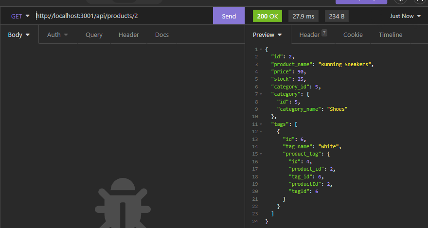
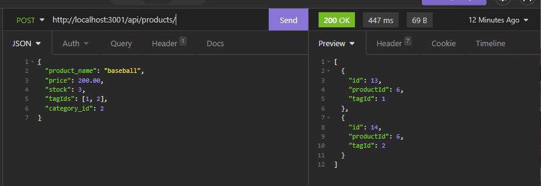

# E-commerce Site Database

## Description

This application creates a back end database and routing to create and send relevant data pertaining to a e-commerce sites storage. Feature of this application include creating, updating, and deleting categories, tags, and products via get, post, and delete methods that are listened by an express server.

This project runs on Node.js and requires 3 npm packages: mysql2 for connecting to sql database and manipulating data, sequalize to call sql commands in a ORM fashion, and dotenv to hide credentials.

## Working Project

### Get request sample screenshot

### Post request sample screenshot

## Table of Contents
* [Installation](#installation)

* [Tutorial](#tutorial)

* [Credits](#credits)

* [License](#license)

* [Questions](#questions) 

## Installation
1) Clone down the repository via ssh key
2) Git Bash/ Terminal to where the directory is stored on your local machine
3) Open mysql shell and run 'source ./db/schema.sql' then exit shell
4) Open the '.env' file and set the values to each key: 'database=ecommerce_db', 'user=root', and 'pass={your sql password}'
4) Run 'npm install' to download the required node packages
5) Run 'node seeds/index.js' to prepopulate sql tables with product information
5) Run 'npm start' to start the server

## Tutorial

[Tutorial Link](https://youtu.be/W6meEHUvbvI)

## Credits
Inquirer package [documentation](https://www.npmjs.com/package//inquirer)

## License
 

Licensed under the [MIT](https://opensource.org/licenses/MIT) license

## Questions
Contact me via email at hmanjun@ucsc.edu
View my other projects on [github](github.com/hmanjun) 